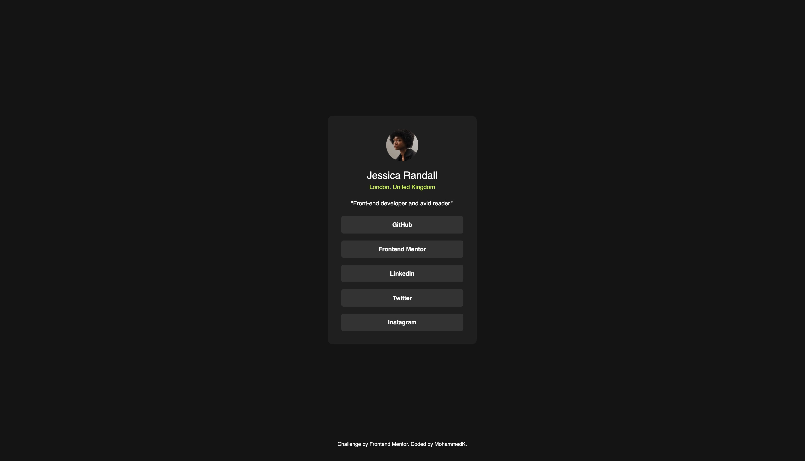

# Frontend Mentor - Blog preview card solution

This is a solution to the [Blog preview card challenge on Frontend Mentor](https://www.frontendmentor.io/challenges/blog-preview-card-ckPaj01IcS). Frontend Mentor challenges help you improve your coding skills by building realistic projects.

## Table of contents

- [Overview](#overview)
  - [The challenge](#the-challenge)
  - [Screenshot](#screenshot)
  - [Links](#links)
- [My process](#my-process)
  - [Built with](#built-with)
  - [Continued development](#continued-development)
- [Author](#author)

## Overview

### The challenge

Users should be able to:

- See hover and focus states for all interactive elements on the page

### Screenshot

### Links

- Solution URL: [http://127.0.0.1:5500/]
- Live Site URL: [https://social-links-profile-main-mk.netlify.app/]

## My process

### Built with

- css flex-box
- semantic html and generic elements (div)
- BEM methodology
- made variables using :root

### Continued development

I mainly want to focus on layout-related topics like Flexbox and Grid, but also on CSS in general—for example, how block vs. inline elements behave, specificity, etc.

## Author

- Website - [MohammedK](https://social-links-profile-main-mk.netlify.app/)
- Frontend Mentor - [@MohammadAli-K](https://www.frontendmentor.io/profile/MohammadAli-K)
